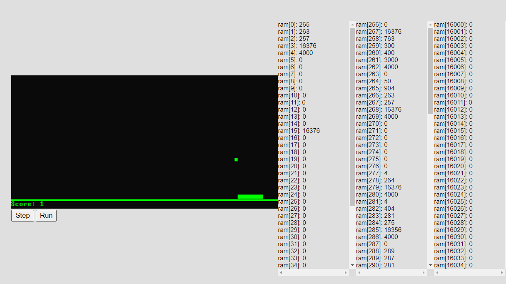

## Jack-VM
---
A web based VM for the Jack language from nand2tetris, running a game of snake!

This program was inspired while I was working through the nand2tetris course. The course is all about virtually building up a computing system from scratch starting from the logic gates all the way to stack machine bytecode running on a virtual machine. The creators of a class provide the virtual machine emulator to run this bytecode, but using this felt somehow incomplete. If I had already taken the time to write an assembler and both the frontend and backend of the compiler, wouldn't it be awesome to also write a virtual machine to run it? Wouldn't it be even cooler to have it work on the web so that others who do nand2tetris could easily share their Jack programs with others?

Toward the second half of my time at Recurse Center I decided to kill two birds with one stone and build this vm in Rust, compiling to webassembly to make it runnable in a browser. The memory and registers are faithfully emulated as specified in the nand2tetris course and the core Jack library has been implemented in a combination of Rust and Jack. 

---
Memory values displayed while running a version of pong, showing the registers, stack, and heap. 

The display was originally also implemented as a linear memory array that was then read into a canvas component on the website, but updating the canvas in this way was too slow. The canvas is instead now updated directly in the wasm code when any draw or output functions are called. 

I would not have been able to do this without the encouragement and help of my batch mates at Recurse Center. I especially want to thank Mary, who paired with me many times and contributed her remarkable skills in languges, compilers, Rust, and programming in general. 

### Future Goals:
- Set up Svelte front end for the VM
- Rewrite Jack compiler in Rust so it can be added as a wasm binding or a webworker
- Add codemirror components 
- Add options for range of memory visualization
